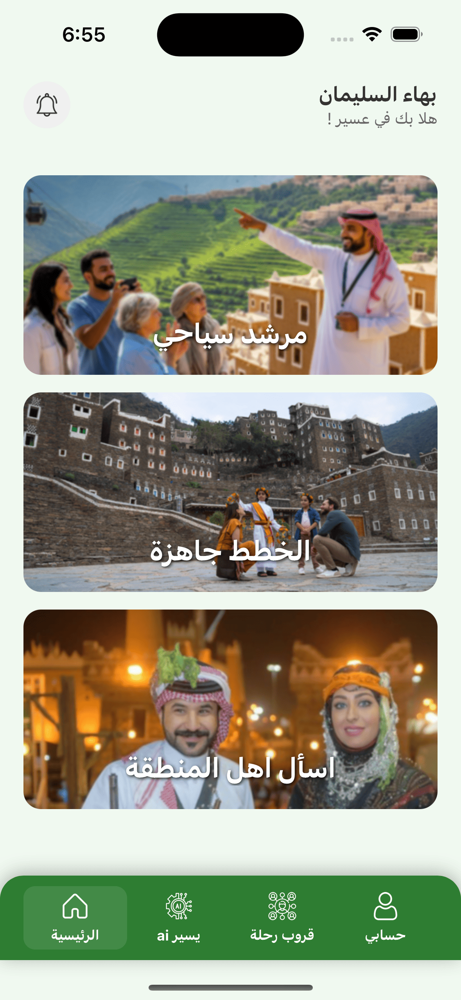
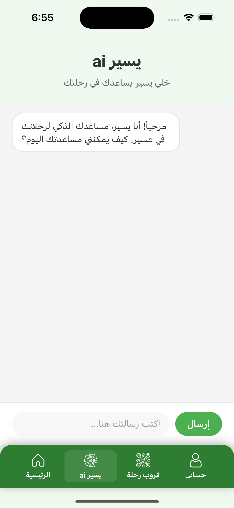
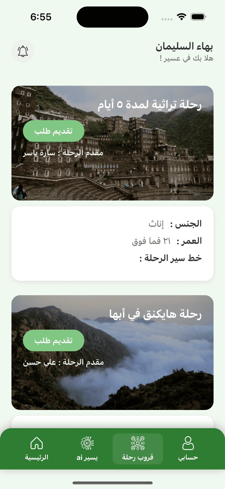
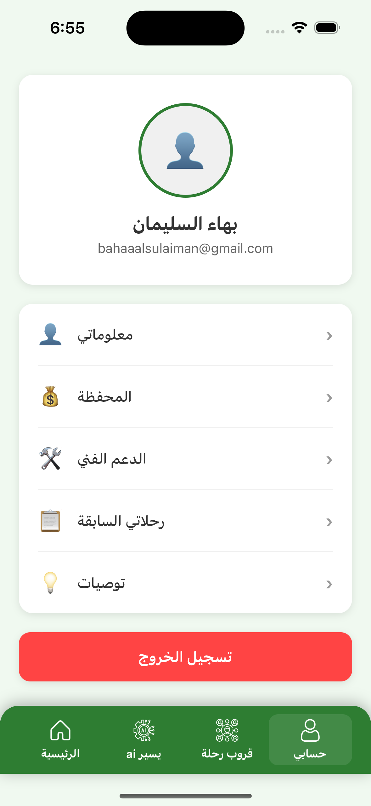
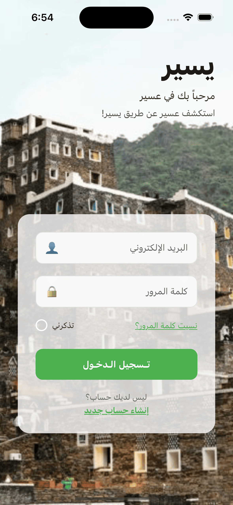

# يسير - تطبيق السياحة في عسير 🏔️

## نظرة عامة على المشروع

**يسير** هو تطبيق سياحي متطور مصمم خصيصاً لمنطقة عسير في المملكة العربية السعودية. يوفر التطبيق تجربة سياحية شاملة ومتكاملة تساعد السياح والمقيمين على استكشاف المنطقة بسهولة وفعالية.


## المميزات الرئيسية

### 🏠 الشاشة الرئيسية
الشاشة الرئيسية تعرض الخدمات الأساسية للتطبيق بطريقة جذابة وعصرية:



- **مرشد سياحي**: ربط السياح بمرشدين محليين معتمدين
- **الخطط الجاهزة**: خطط سياحية معدة مسبقاً لجميع أنواع الرحلات
- **اسأل أهل المنطقة**: منصة تفاعلية للاستفسار من السكان المحليين

### 🤖 يسير AI
واجهة ذكية اصطناعية تقدم مساعدة شخصية ومخصصة:



- **دردشة ذكية**: محادثة تفاعلية مع الذكاء الاصطناعي
- **وكيل ذكي للحجوزات**: مساعدة في حجز الفنادق والمطاعم والأنشطة السياحية
- **توصيات مخصصة**: اقتراحات بناءً على تفضيلات المستخدم
- **مساعدة فورية**: إجابات سريعة على الاستفسارات السياحية
- **تخطيط الرحلات**: مساعدة في تخطيط المسار والأنشطة اليومية
- **حجز المرشدين**: ربط السياح بالمرشدين المحليين المعتمدين
- **معلومات فورية**: تحديثات عن الطقس والأحداث المحلية

### 👥 رحلات جماعية
تنظيم رحلات جماعية مع أصدقاء وعائلة:



- **رحلات تراثية**: استكشاف التراث الثقافي لمنطقة عسير
- **رحلات جبلية**: مغامرات في الجبال والطبيعة الخلابة
- **تنسيق جماعي**: سهولة في تنظيم الرحلات مع المجموعات

### 💡 نظام التوصيات
منصة لتبادل التجارب والتوصيات:


- **إرسال توصيات**: مشاركة التجارب الشخصية مع الآخرين
- **توصيات الأصدقاء**: الاطلاع على توصيات الأصدقاء والمعارف
- **تقييمات موثوقة**: نظام تقييم شفاف وموثوق

### 👤 الحساب الشخصي
إدارة الحساب الشخصي والإعدادات:



- **معلومات شخصية**: تحديث البيانات الشخصية
- **المحفظة**: إدارة المدفوعات والمعاملات المالية
- **الدعم الفني**: التواصل مع فريق الدعم
- **رحلاتي السابقة**: سجل الرحلات المنجزة

### 🔐 تسجيل الدخول
واجهة تسجيل دخول عصرية ومأمونة:



- **تصميم عصري**: واجهة جذابة مع خلفية من منطقة عسير
- **أمان عالي**: حماية متقدمة للبيانات الشخصية
- **سهولة الاستخدام**: تجربة مستخدم سلسة ومريحة

## التقنيات المستخدمة

- **React Native**: تطوير تطبيقات الهاتف المحمول
- **Expo**: منصة تطوير سريعة وموثوقة
- **TypeScript**: برمجة آمنة ومنظمة
- **Expo Router**: نظام تنقل متقدم
- **React Native Animated**: رسوم متحركة سلسة

## متطلبات التشغيل

### المتطلبات الأساسية
- Node.js (الإصدار 18 أو أحدث)
- npm أو yarn
- Expo CLI
- Android Studio (للتطوير على Android)
- Xcode (للتطوير على iOS)

### التثبيت والتشغيل

1. **استنساخ المشروع**
   ```bash
   git clone https://github.com/YOUR_USERNAME/yaseer-app.git
   cd yaseer-app
   ```

2. **تثبيت التبعيات**
   ```bash
   npm install
   ```

3. **تشغيل التطبيق**
   ```bash
   npx expo start
   ```

4. **اختبار التطبيق**
   - استخدم Expo Go على هاتفك
   - أو شغل المحاكي (Android/iOS)

## هيكل المشروع

```
yaseer-app/
├── app/                    # شاشات التطبيق
│   ├── mainScreen.tsx      # الشاشة الرئيسية
│   ├── login.tsx          # تسجيل الدخول
│   ├── forYouScreen.tsx   # يسير AI
│   ├── togetherScreen.tsx # الرحلات الجماعية
│   ├── accountScreen.tsx  # الحساب الشخصي
│   └── ...
├── components/            # المكونات المشتركة
│   ├── Header.tsx        # رأس الصفحة
│   ├── BottomNavigation.tsx # التنقل السفلي
│   └── SearchBar.tsx     # شريط البحث
├── assets/               # الملفات الثابتة
│   ├── images/          # الصور
│   └── icons/           # الأيقونات
└── ...
```

## المساهمة في المشروع

نرحب بمساهماتكم! للمساهمة في تطوير التطبيق:

1. انسخ المشروع (Fork)
2. أنشئ فرع جديد للميزة (Feature Branch)
3. اكتب التغييرات
4. أرسل طلب دمج (Pull Request)


## التواصل

- **البريد الإلكتروني**: [bahaaalsulaiman@icloud.com]
- **GitHub**: [github.com/bahaa-prog]
- **LinkedIn**: [www.linkedin.com/in/bahaa-alsulaiman-80624a211]

---

**يسير** - استكشف عسير بطريقة ذكية وممتعة! 🚀
